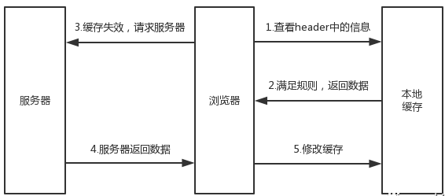
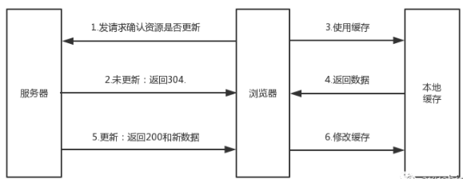

### http1.0 -> http1.1

-   引入了更多的缓存控制策略，如 Entity tag，If-Unmodified-Since, If-Match, If-None-Match 等
-   HTTP/1.1 允许范围请求，即在请求头中加入 Range 头部
-   HTTP/1.1 的请求消息和响应消息都必须包含 Host 头部，以区分同一个物理主机中的不同虚拟主机的域名
-   keepalive 重用 TCP 链接，实现 HTTP 长链接,在一个 TCP 连接上可以传送多个 HTTP 请求和响应，减少了建立和关闭连接的消耗和延迟

### http1.1 -> http2.0

-   二进制分帧
-   多路复用 (Multiplexing) / 连接共享
-   头部压缩（Header Compression）
-   请求优先级（Request Priorities）
-   服务端推送（Server Push）

### 缓存

#### 强缓存

主要查看 header 头中的 Expire 和 Cache-control 来判断是否满足规则

-   Expire

&emsp;&emsp;这个字段包含了一个时间，过了这个时间，响应将会失效，通过设置 Expire 来设置缓存有一个致命缺点：如果我修改了客户端的本地时间，就会导致判断缓存失效。

-   Cache-Control

&emsp;&emsp;在 HTTP/1.1 中，增加了一个字段 Cache-Control ，它包含一个 max-age 属性，该字段表示资源缓存的最大有效时间，这就是一个相对时间。
`Cache-Control:max-age=600`
单位为秒

除此之外还有部分属性:

| 属性     |                                                    |
| -------- | -------------------------------------------------- |
| no-cache | 需要进行协商缓存，发送请求到服务器确认是否使用缓存 |
| no-store | 禁止使用缓存，每一次都要重新请求数据               |
| public   | 默认设置                                           |
| private  | 不能被多用户共享                                   |

Cache-Control 的优先级别高于 Expire

#### 协商缓存

如果强缓存没有命中，会采用协商缓存策略

1. 把资源标识，比如 If-Modify-Since 或 Etag 发送到服务器，确认资源是否更新
2. 如果资源未更新，返回 304 标识，带回 Not Modified 字符串，直接使用浏览器缓存
3. 如果资源更新，返回 200 和新的数据。
4. 根据返回的数据更新缓存

-   Last-Modified，If-Modified-Since

    &emsp;&emsp;第一次请求资源的时候，服务器在 header 中返回 Last-Modified 字段，这是服务器资源的最后修改时间
    浏览器再次请求该资源时，会将第一次 Last-Modified 字段的值作为 If-Modified-Since 的值一起发送给服务器，服务器会对比资源当前的 Last-Modified(可能已经不是第一次返回的值了)和浏览器请求中的 If-Modified-Since 的值，如果相等，说明资源还没有发生变化，直接返回 304，否则返回新的资源。
-   ETag， If-None-Match

    &emsp;&emsp;一般由文件 hash 生成，也就是资源的唯一标识，资源变化则 ETag 不一样。
    首次请求资源时，服务器会返回一个 ETag 标识，再次请求时会将首次 ETag 的值作为 If-None-Match 的值一起发送给服务器，服务器会对比此时资源的 ETag 和请求头中的 If-None-Match，如果相同，则直接返回 304。否则返回新的资源
    ETag 的优先级高于 Last-Modified
