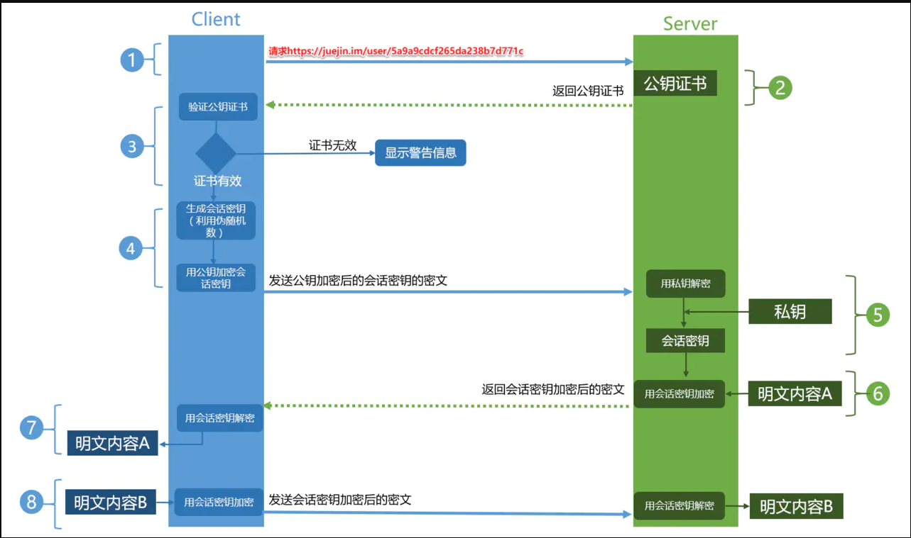
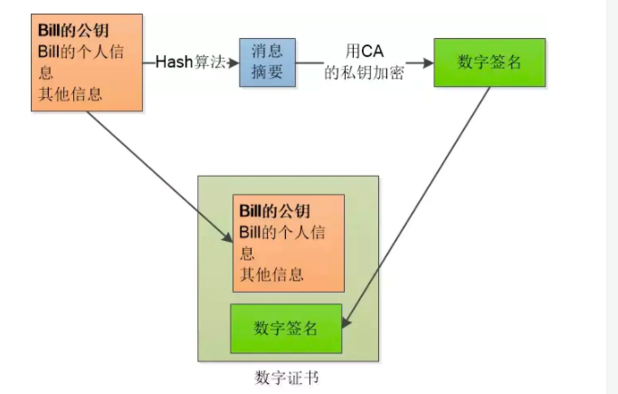
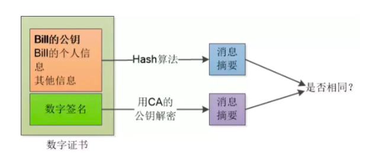

### HTTP 存在的问题

-   通信使用明文（不加密），内容可能被窃听
-   无法证明报文的完整性，所以可能遭篡改
-   不验证通信方的身份，因此有可能遭遇伪装

### HTTPS 流程图

#### 验证证书签名

1. 服务器向第三方机构 CA 申请认证。
2. 信息审核通过，CA 会向申请者签发认证文件-证书。证书包含以下信息：申请者公钥、申请者的组织信息和个人信息、签发机构 CA 的信息、有效时间、证书序列号等信息的明文，同时包含一个签名。 其中签名的产生算法：首先，使用散列函数计算公开的明文信息的信息摘要，然后，采用 CA 的私钥对信息摘要进行加密，密文即签名
   
3. 客户端 Client 向服务器 Server 发出请求时，Server 返回证书文件
4. 客户端 Client 读取证书中的相关的明文信息，采用相同的散列函数计算得到信息摘要，然后，利用对应 CA 的公钥解密签名数据，对比证书的信息摘要，如果一致，则可以确认证书的合法性，即服务器的公开密钥是值得信赖的
   

#### 客户端生成会话秘钥（对称加密的秘钥）

验证证书成功后，说明服务器的公开秘钥是值得信赖的，客户端基于一定规则生成本次会话的秘钥，并使用服务器的公钥加密传输。

#### 服务器接受会话秘钥

服务器接收客户端发送的会话秘钥，使用服务器私钥解密，然后使用这个会话秘钥对本次会话要发送的内容进行对称加密传输。

#### 客户端与服务器通讯

客户端使用生成的会话秘钥对服务器发送的内容进行对称解密，并对向服务器发送的会话内容进行对称加密传输

### 使用对称加密和非对称加密相结合的原因

-   单独使用对称加密，秘钥的传输存在被截获的风险
-   单独使用非对称加密，公钥是公开的，所以针对私钥加密的信息，黑客截获后可以使用公钥进行解密，获取其中的内容
-   单独使用非对称加密，公钥并不包含服务器的信息，使用非对称加密算法无法确保服务器身份的合法性，存在中间人攻击的风险，服务器发送给客户端的公钥可能在传送过程中被中间人截获并篡改
-   单独使用非对称加密在数据加密解密过程需要消耗一定时间，降低了数据传输效率
