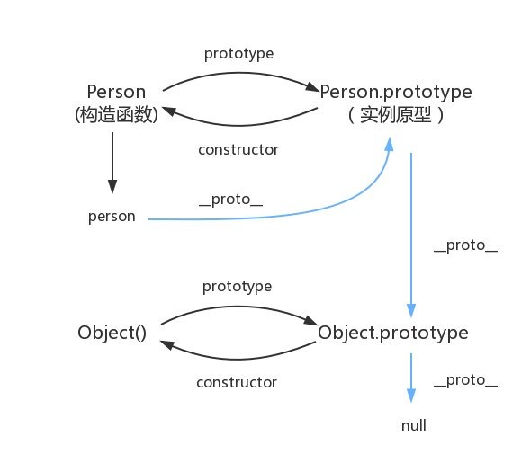
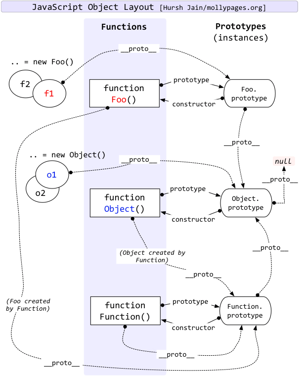

先上一张图:



图中蓝色的箭头就是原型链,对象的属性查询路线也是根据这个链路进行查找。

#### 比较容易弄错的几个原型

```javascript
// Function.prototype是一个对象o，即是Object的实例， 所以o.__proto__ === Object.prototype
Function.prototype.__proto__ === Object.prototype;
function Person() {}
let person = new Person();
// 同上
Person.prototype.__proto__ === Object.prototype;
// Person 是一个函数对象，即是Function的实例，所以 Person.__proto__ === Function.prototype
Person.__proto__ === Function.prototype
// Object也是一个函数对象
Object.__proto__ === Function.prototype
let f = new Function();
// 同上
f.__proto__ === Function.prototype;
// Function本身是一个函数，但是它又是函数的构造函数，翻译一下就是Function是Function本身的一个实例，虽然听着有点扯。
// 我觉得这应该是js这门语言的约定，Function自己创造了自己
Function.__proto__ === Function.prototype  
```

最后可以看看复杂一点的图：

